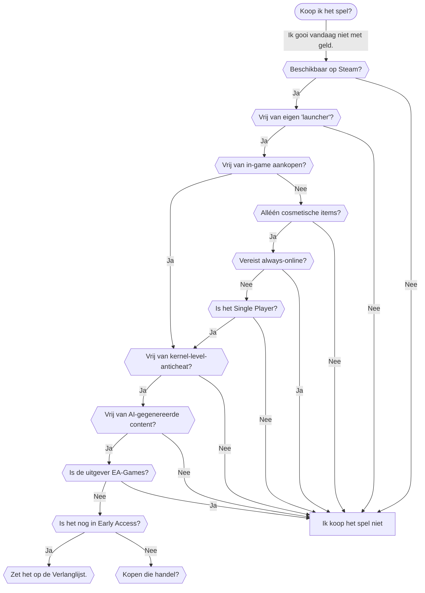

```mermaid
flowchart TD
  K([Koop ik het spel?]) -->|Ik gooi vandaag niet met geld.| St{{Beschikbaar op Steam?}}
  
  St -->|Ja| Ln{{Vrij van eigen 'launcher'?}}
  St -->|Nee| N[Ik koop het spel niet]

  Ln -->|Ja| Ig{{Vrij van in-game aankopen?}}
  Ln -->|Nee| N

  Ig -->|Ja| Kl{{Vrij van kernel-level-anticheat?}}
  Ig -->|Nee| Cm{{Alléén cosmetische items?}}

  Cm -->|Ja| Ao{{Vereist always-online?}}
  Cm -->|Nee| N

  Ao -->|Nee| Sp{{Is het Single Player?}}
  Ao -->|Ja| N

  Sp -->|Ja| Kl
  Sp -->|Nee| N

  Kl -->|Ja| Ai{{Vrij van AI-gegenereerde content?}}
  Kl -->|Nee| N

  Ai -->|Ja| Ea{{Is de uitgever EA-Games?}}
  Ai -->|Nee| N

  Ea -->|Nee| Er{{Is het nog in Early Access?}}
  Ea -->|Ja| N

  Er -->|Ja| Wl{{Zet het op de Verlanglijst.}}
  Er -->|Nee| B{{Kopen die handel?}}

```